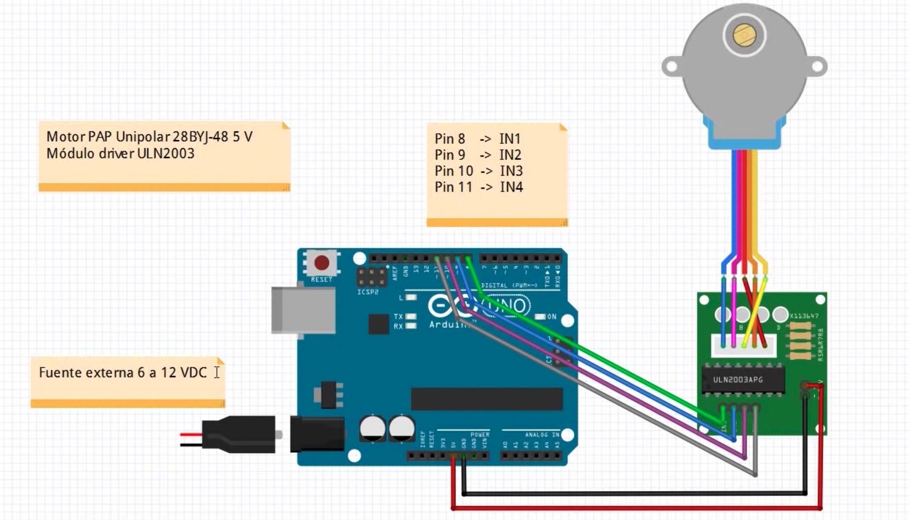
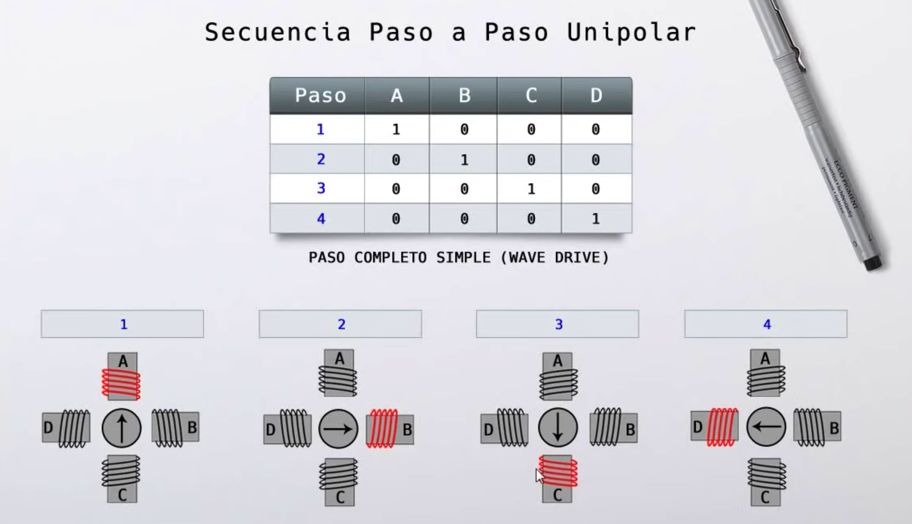
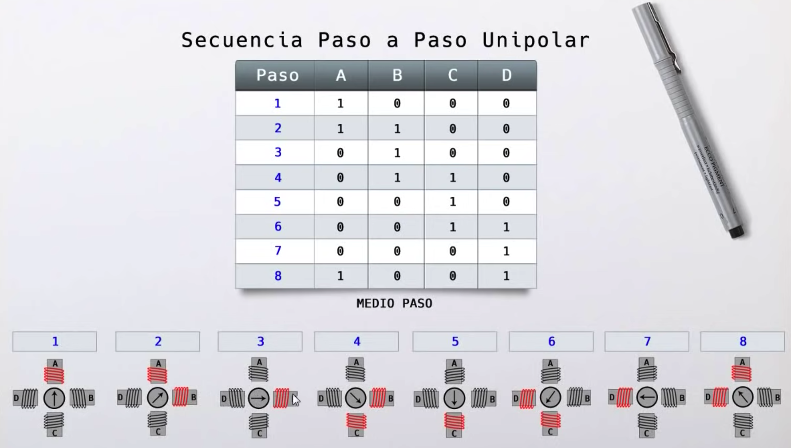

## Componentes

* Arduino uno
* Step motor 28BYJ-48
* ULN2003AN

# Circuit

# Type of rotation controller

Tenemos 3 formas de energizar las bobinas para que gire el motor

## Wave drive (paso completo simple)
Es la forma más simple 

## Paso completo con dos bobinas
Es la forma donde tenemos el máximo torque

## Medio paso
De las tres formas es la que tiene más precisión.

# Sources:

* [youtube](https://www.youtube.com/watch?v=2-nVV9S7leM)

* [uln2003](https://www.inventable.eu/2018/02/09/uln2003-driver-salida-microcontroladores/)
