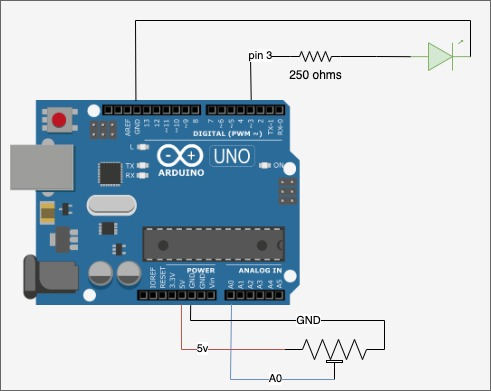

project:

* bright_led: Source to control the bright of a led. - fuente para controlar el brillo de un led
* turnon_turnoff_velocity: Source to control the velocity of turn on and turn off a led - fuente para controlar la velocidad de encendido y apagado de un led

**circuit**
