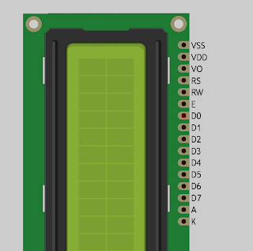

# Temperature Monitor

* Arduino uno
* DS18B20 sensor
* one 4.7k resistor
* Display LCD 1602A
* Cable USB
* Cables
* Breadboard
* potentiometer 5k
* 1x welder

**DS18B20** is 1-Wire digital temperature sensor from Maxim IC. Reports degrees in Celsius with 9 to 12-bit precision, from -55 to 125 (+/-0.5). Each sensor has a unique 64-Bit Serial number etched into it - allows for a huge number of sensors to be used on one data bus

# Monitor de temperatura

## Componentes

* Arduino uno
* Una resistencia de 4.75k
* DS18B20 - Sensor de temperatura
* Una Pantalla LCD 1602A
* Cable USB
* Cables
* Breadboard
* potenciómetro 5k
* 16x pines macho 2.54 mm (opcional)
* 1x bobina de estaño
* 1x soldador

**DS18B20** es un sensor de temperatura digital de 1 cable de Maxim IC. Reporta grados en Celsius con precisión de 9 a 12 bits, de -55 a 125 (+/-0.5). Cada sensor tiene un número de serie único de 64 bits grabado, lo que permite utilizar una gran cantidad de sensores en un bus de datos.

## Conexión del sensor de temperatura

> Importante: dependiendo del fabricante los conectores 1 y 3 pueden venir invertidos. 

## Conexión pantalla

### Pasos de conexión

**Conexión de energía**
1. fila GND (fila -) de la breadboard   –> pin 1 de la LCD (VSS)
2. fila 5V (fila +) de la breadboard    –> pin 2 de la LCD (VDD)
3. fila 5V (fila +) de la breadboard    –> pin 15 de la LCD (A)
4. fila GND (fila -) de la breadboard   –> pin 16 de la LCD (K)

**Conexión de un potenciómetro para poder regular el contraste**

5. primer pin del potenciómetro —> GND de la breadboard (fila -)
6. pin de en medio potenciómetro –> pin 3 de la pantalla LCD (VO)
7. tercer pin del potenciómetro —> 5V de la breadboard (fila -)

**Conexión de los digitales**

8. pin 4 de la LCD (RS) —> pin 7 del arduino (salida digital, PWM)
9. pin 5 de la LCD (RW) –> GND de la breadboard (fila -)
10. pin 6 de la LCD (E) –> pin 8 de la placa Arduino UNO (PWM)
11. pin 11 de la LCD (D4) –> pin 9 de la placa Arduino UNO (PWM)
12. pin 12 de la LCD (D5) –> pin 10 de la placa Arduino UNO (PWM)
13. pin 13 de la LCD (D6) –> pin 11 de la placa Arduino UNO (PWM)
14. pin 14 de la LCD (D7) –> pin 12 de la placa Arduino UNO (PWM)

---
---
---

## Datasheets
[ds18b20](../../datasheets/ds18b20_datasheet.pdf)

## Display diagram

* VSS que es el pin de negativo o masa o 0 volts o GND.
* VDD es la alimentación principal de la pantalla y el chip, lleva 5 voltios (recomendable ponerle en serie una resistencia para evitar daños, con una de 220 ohmnios es suficiente).
* VO es el contraste de la pantalla, debe conectarse con un potenciometro de unos 10k ohms o una resistencia fija una vez que encontremos el valor deseado de contraste. Tengan en cuenta que si no conectan esto, no verán nada.
* RS es el selector de registro (el microcontrolador le comunica a la LCD si quiere mostrar caracteres o si lo que quiere es enviar comandos de control, como cambiar posición del cursor o borrar la pantalla, por ejemplo).
* RW es el pin que comanda la lectura/escritura. En nuestro caso siempre estará en 0 (conectado a GND) para que escriba en todo momento.
* E es enable, habilita la pantalla para recibir información.
* D0~D3 no los vamos a utilizar. Como pueden ver la pantalla tiene un bus de datos de 8 bits, de D0 a D7. Nosotros solamente utilizaremos 4 bits, de D4 a D7, que nos servirán para establecer las líneas de comunicación por donde se transfieren los datos.
* A y K son los pines del led de la luz de fondo de la pantalla. A se conectará a 4 o 5 volts y K a gnd.

---
---
---

Referencias

https://create.arduino.cc/projecthub/TheGadgetBoy/ds18b20-digital-temperature-sensor-and-arduino-9cc806

https://www.electrogeekshop.com/tutorial-conectando-una-pantalla-lcd-1602a-a-arduino-uno/