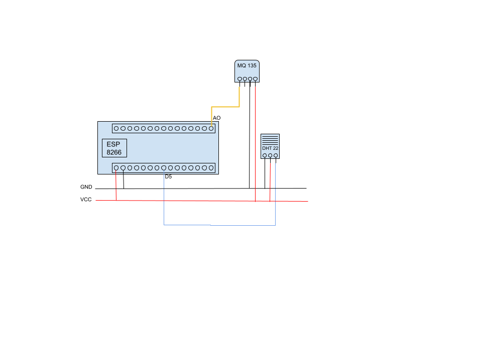

# Pollution and Temperature monitos

El objetivo es generar un dispositivo capaz de medir la temperatura y contaminación de una habitación.

Para esto se utilizara los siguientes dispositivos:
* ESP8266: [Micro controlador](https://github.com/esp8266/Arduino)
* DHT22: [sensor de temperatura](https://www.sparkfun.com/datasheets/Sensors/Temperature/DHT22.pdf)
* MQ 135: [sensor de polución](https://www.olimex.com/Products/Components/Sensors/Gas/SNS-MQ135/resources/SNS-MQ135.pdf)

## Circuito

